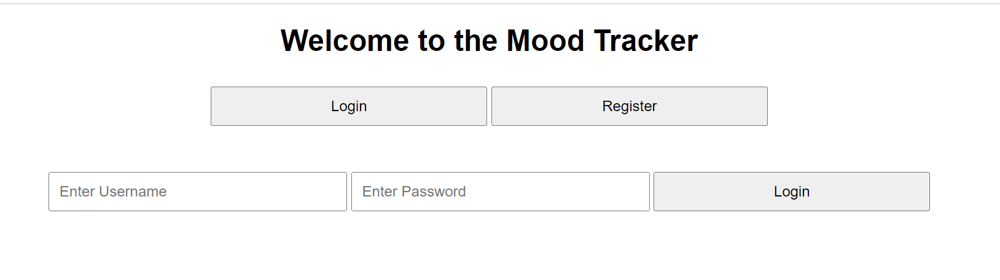
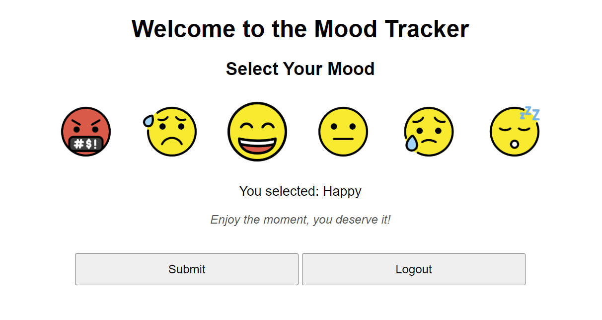

# EXCS Movember Hackathon
## Team: Misha Artemiev, Etienne Hackett, Emre Acarsoy

This is our team submission for the EXCS Movember Hackathon, with the theme Code for Good / Men's Health.  

### The website is online at (https://climberlog.co.uk)

## Summary

Our project is a mood tracking website. Users can register with a username and password, and log in to track their mood.  
Upon logging in, they can select an emoji based on how they feel. They will then get relevant advice for their mood, and will be able to view their mood history over the past month.

## Interface

This is an example of the login screen:  

And this is an example of the selection interface:  

